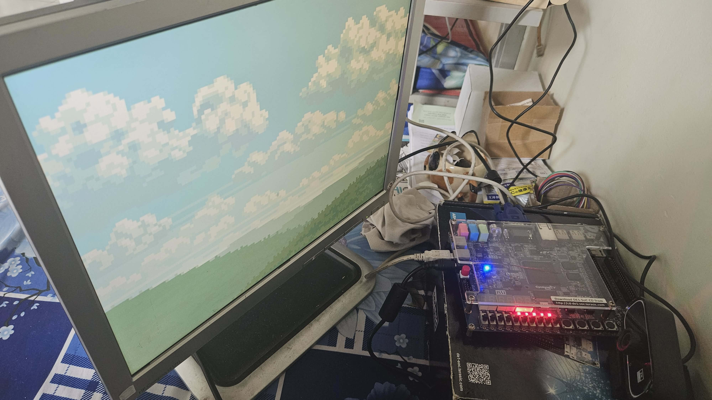
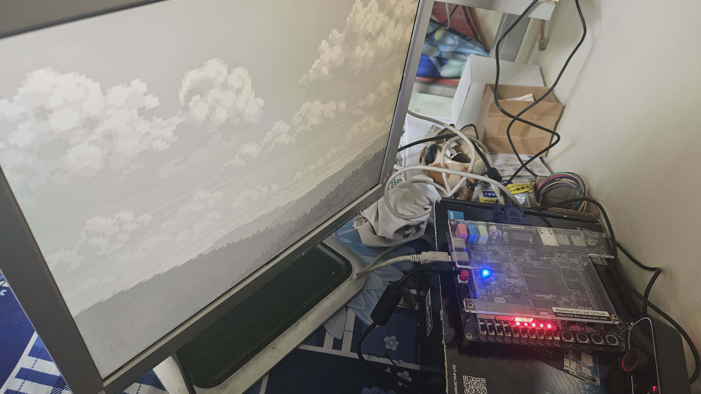
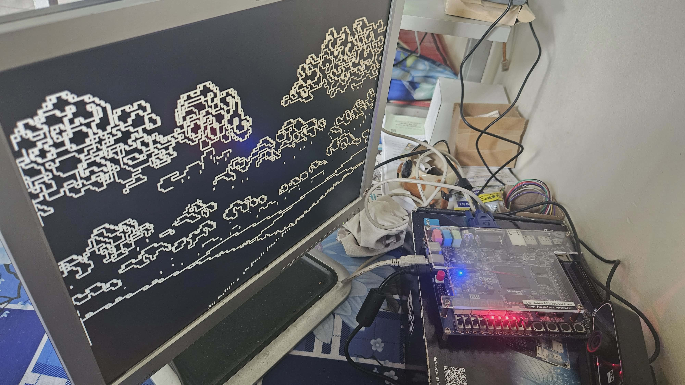
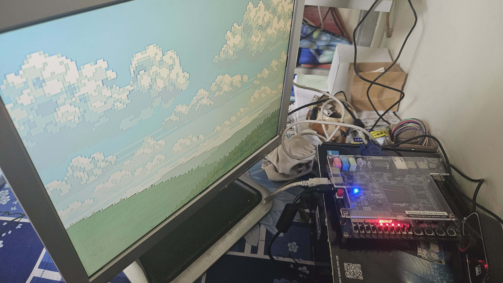

# DE1-SoC VGA Image Processing Pipeline

Real-time image processing pipeline implemented on the Terasic DE1-SoC (Cyclone V FPGA). A static RGB565 image is stored in SDRAM, streamed through a custom VGA pipeline, processed in hardware, and displayed at **640×480 @ 60Hz** via the onboard **ADV7123 VGA DAC**.

## Features

* RGB565 image storage in SDRAM
* Custom SDRAM read controller (Avalon-MM master)
* Dual-clock FIFO for SDRAM ↔ VGA clock-domain crossing
* RGB565 to RGB10 decoder
* Real-time image processing on FPGA
* VGA output (640×480 @ 60Hz)

### Image Processing Modes

| SW[1:0] | Mode                               |
| ------- | ---------------------------------- |
| 00      | RGB (Original)                     |
| 01      | Grayscale (BT.601)                 |
| 10      | Sobel Edge Detection (3×3)         |
| 11      | Sharpen Filter (5-point Laplacian) |

---

## Architecture

```text
RGB565 Image (.bin)
          │
          ▼
        SDRAM
          │
          ▼
 SDRAM Read Controller
          │
          ▼
    Dual-Clock FIFO
          │
          ▼
    RGB565 Decoder
          │
          ▼
  VGA Image Processor
 (RGB / Gray / Sobel / Sharpen)
          │
          ▼
    VGA Controller
          │
          ▼
 ADV7123 DAC → VGA Monitor
```

---

## Results

### Python Verification

| RGB565 Conversion       | Grayscale & Sobel              | Sharpen                   |
| ----------------------- | ------------------------------ | ------------------------- |
| `docs/image2rgb565.png` | `docs/gray&sobel_detector.png` | `docs/sharpen_filter.png` |

### FPGA VGA Output

| RGB | Grayscale | Sobel | Sharpen |
|-----|----------|-------|---------|
|  |  |  |  |

---

## Running on FPGA

1. Compile and program the FPGA design.
2. Convert an image to RGB565 `.bin`.
3. Load the image into SDRAM using the provided TCL script.
4. Enable VGA output through the Nios II UART console.
5. Select the processing mode using `SW[1:0]`.

A complete demonstration is available in:

```text
docs/Run_on_FPGA.mp4
```

---

## Hardware
* Terasic DE1-SoC, Cyclone V FPGA (5CSEMA5F31C6)
* VGA Monitor
* USB-Blaster / JTAG

## Authors & Contributors
* **Nguyen Dang Phuong Duy** - [DuyNDP](https://github.com/DuyNDP)
* **Vu Dai Duong** - [VuDaiDuong_325](https://github.com/VuDaiDuong-325)
